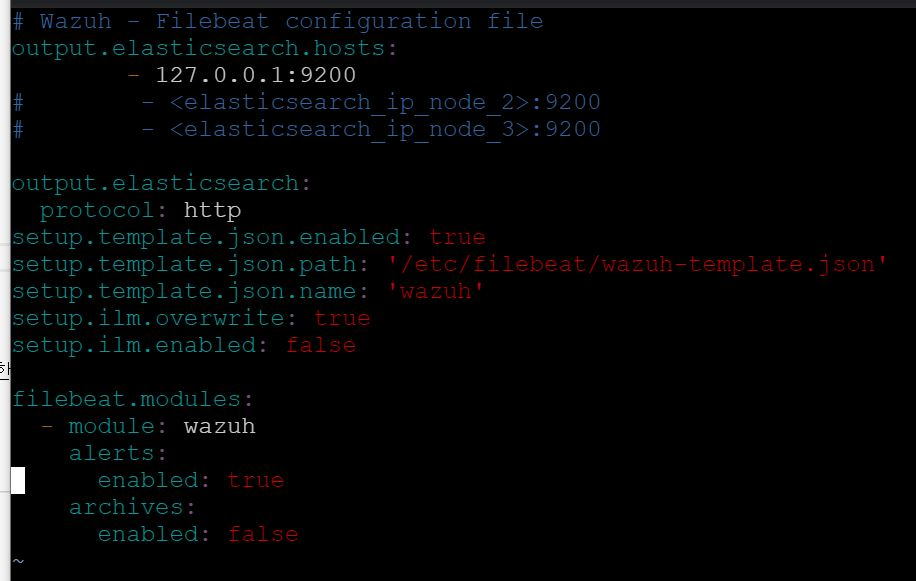

# 프로그램 사용법

## Wazuh 설치

클라우드 플랫폼을 사용하여 구축한다. 본 프로젝트에서는 GCP를 사용하여 프로젝트를 구성한다.


다음과 같은 사양의 인스턴스를 구성한다.


우분투 20.04버전의 디스크를 사용하고 http,https트래픽허용을 체크한다. 그후 네트워크 태그에 allfor이라 적는다.


네트워크 방화벽 설정을 위해 다음과 같은 메뉴로 들어가준다.


이름,태그를 allfor로 지어주고

소스필터 IP범위에 0.0.0.0을 입력한다.

그리고 프로토콜 및 포트는 모두 허용에 체크해준다.

그러면 다음 위와 같이 설정이 된다.

그리고 [다음 페이지](https://documentation.wazuh.com/current/installation-guide/index.html) wazuh에 대한 설치페이지이다.

인스턴스에 SSH연결을 하여 root권한으로

```
curl -so ~/unattended-installation.sh https://raw.githubusercontent.com/wazuh/wazuh-documentation/4.1/resources/open-distro/unattended-installation/unattended-installation.sh && bash ~/unattended-installation.sh
````

명령을 넣어준다.

완료가 될때까지 기다려주고

완료가 된다면...

다음을 입력해서 Kibana Security plugin을 삭제시켜준다.
(실행은 항상 root로 한다.)
```
/usr/share/kibana/bin/kibana-plugin remove opendistroSecurityKibana --allow-root
```

그리고 /etc/elasticsearch/elasticsearch.yml 파일에서


다음과같이 설정파일을 적어준다.

마찬가지로 /etc/kibana/kibana.yml


/etc/filebeat/filebeat.yml 파일 또한



로 적어준다.

그러면 인스턴스 외부 http://<IP>:5601를 통해서 Kibana 접속을 확인한다.

'/usr/share/kibana/data/wazuh/config/wazuh.yml' 파일에서 

주소부분을 https->http 다음과 같이 바꿔주고

'/var/ossec/api/configuration/api.yaml 파일에서


마지막으로

/var/ossec/ruleset/rules 폴더에서

0575-win-base_rules.xml 파일안에
'''
  <rule id="60009" level="3">
    <if_sid>60000</if_sid>
    <field name="win.system.severityValue">^INFORMATION$</field>
    <description>Windows informational event</description>
    <options>no_full_log</options>
  </rule>
  <rule id="60010" level="3">
    <if_sid>60000</if_sid>
    <field name="win.system.severityValue">^WARNING$</field>
    <description>Windows warning event</description>
    <options>no_full_log</options>
    <group>gpg13_4.12,</group>
  </rule>
  <rule id="60004" level="3">
    <if_sid>60000</if_sid>
    <field name="win.system.channel">^Microsoft-Windows-Sysmon/Operational$</field>
    <options>no_full_log</options>
    <description>Group of Windows rules for the Sysmon channel</description>
  </rule>
'''
해당부분을 찾아 level을 위와같이 3으로 고친다.

0595-win-sysmon_rules.xml 파일에선
'''
  <rule id="61600" level="3">
    <if_sid>60004</if_sid>
    <field name="win.system.severityValue">^INFORMATION$</field>
    <description>Windows Sysmon informational event</description>
    <options>no_full_log</options>
  </rule>

  <rule id="61601" level="3">
    <if_sid>60004</if_sid>
    <field name="win.system.severityValue">^WARNING$</field>
    <description>Windows Sysmon warning event</description>
    <options>no_full_log</options>
    <group>gpg13_4.12,</group>
  </rule>
  <rule id="61603" level="3">
    <if_sid>61600</if_sid>
    <field name="win.system.eventID">^1$</field>
    <description>Sysmon - Event 1: Process creation $(win.eventdata.description)</description>
    <options>no_full_log</options>
    <group>sysmon_event1,</group>
  </rule>

  <rule id="61604" level="3">
    <if_sid>61600</if_sid>
    <field name="win.system.eventID">^2$</field>
    <description>Sysmon - Event 2: A process changed a file creation time by $(win.eventdata.sourceImage)</description>
    <options>no_full_log</options>
    <group>sysmon_event2,</group>
  </rule>

  <rule id="61605" level="3">
    <if_sid>61600</if_sid>
    <field name="win.system.eventID">^3$</field>
    <description>Sysmon - Event 3: Network connection by $(win.eventdata.sourceImage)</description>
    <options>no_full_log</options>
    <group>sysmon_event3,</group>
  </rule>

  <rule id="61606" level="3">
    <if_sid>61600</if_sid>
    <field name="win.system.eventID">^4$</field>
    <description>Sysmon - Event 4: Sysmon service state changed by $(win.eventdata.sourceImage)</description>
    <options>no_full_log</options>
    <group>sysmon_event4,</group>
  </rule>

  <rule id="61607" level="3">
    <if_sid>61600</if_sid>
    <field name="win.system.eventID">^5$</field>
    <description>Sysmon - Event 5: Process terminated by $(win.eventdata.sourceImage)</description>
    <options>no_full_log</options>
    <group>sysmon_event5,</group>
  </rule>

  <rule id="61608" level="3">
    <if_sid>61600</if_sid>
    <field name="win.system.eventID">^6$</field>
    <description>Sysmon - Event 6: Driver loaded. Signature is $(win.eventdata.signature)</description>
    <options>no_full_log</options>
    <group>sysmon_event6,</group>
  </rule>

  <rule id="61609" level="3">
    <if_sid>61600</if_sid>
    <field name="win.system.eventID">^7$</field>
    <description>Sysmon - Event 7: Image loaded by $(win.eventdata.sourceImage)</description>
    <options>no_full_log</options>
    <group>sysmon_event7,</group>
  </rule>

  <rule id="61610" level="3">
    <if_sid>61600</if_sid>
    <field name="win.system.eventID">^8$</field>
    <description>Sysmon - Event 8: CreateRemoteThread by $(win.eventdata.sourceImage)</description>
    <options>no_full_log</options>
    <group>sysmon_event8,</group>
  </rule>

  <rule id="61611" level="3">
    <if_sid>61600</if_sid>
    <field name="win.system.eventID">^9$</field>
    <description>Sysmon - Event 9: RawAccessRead by $(win.eventdata.sourceImage)</description>
    <options>no_full_log</options>
    <group>sysmon_event9,</group>
  </rule>

  <rule id="61612" level="3">
    <if_sid>61600</if_sid>
    <field name="win.system.eventID">^10$</field>
    <description>Sysmon - Event 10: ProcessAccess by $(win.eventdata.sourceImage)</description>
    <options>no_full_log</options>
    <group>sysmon_event_10,</group>
  </rule>

  <rule id="61613" level="3">
    <if_sid>61600</if_sid>
    <field name="win.system.eventID">^11$</field>
    <description>Sysmon - Event 11: FileCreate by $(win.eventdata.image)</description>
    <options>no_full_log</options>
    <group>sysmon_event_11,</group>
  </rule>

  <rule id="61614" level="3">
    <if_sid>61600</if_sid>
    <field name="win.system.eventID">^12$</field>
    <description>Sysmon - Event 12: RegistryEvent (Object create and delete) by $(win.eventdata.sourceImage)</description>
    <options>no_full_log</options>
    <group>sysmon_event_12,</group>
  </rule>

  <rule id="61615" level="3">
    <if_sid>61600</if_sid>
    <field name="win.system.eventID">^13$</field>
    <description>Sysmon - Event 13: RegistryEvent (Value Set) by $(win.eventdata.Image)</description>
    <options>no_full_log</options>
    <group>sysmon_event_13,</group>
  </rule>

  <rule id="61616" level="3">
    <if_sid>61600</if_sid>
    <field name="win.system.eventID">^14$</field>
    <description>Sysmon - Event 14: RegistryEvent (Key and Value Rename) by $(win.eventdata.Image)</description>
    <options>no_full_log</options>
    <group>sysmon_event_14,</group>
  </rule>

  <rule id="61617" level="3">
    <if_sid>61600</if_sid>
    <field name="win.system.eventID">^15$</field>
    <description>Sysmon - Event 15: FileCreateStreamHash by $(win.eventdata.Image)</description>
    <options>no_full_log</options>
    <group>sysmon_event_15,</group>
  </rule>
'''

해당 부분을 모두 찾아 level 을 3으로 바꿔주고
파일 끝부분에 아래의 내용을 추가시킨다.

'''
  <rule id="61644" level="3">
    <if_sid>61600</if_sid>
    <field name="win.system.eventID">^22$</field>
    <description>Sysmon - Event 22: DNS Query to $(win.eventdata.QueryName) by $(win.eventdata.Image)</description>
    <options>no_full_log</options>
    <group>sysmon_event_15,</group>
  </rule>
'''

/var/ossec/etc/rules/local_rules.xml의 파일안에서는 파일 끝에 다음의 내용을 추가시킨다.
'''
<rule id="100002" level="0">
    <if_sid>60000</if_sid>
    <field name="win.system.channel">^Microsoft-Windows-NetworkProfile/Operational$</field>
    <options>no_full_log</options>
    <description>Group of Windows rules for the NetworkProfile</description>
  </rule>

  <rule id="100003" level="3">
    <if_sid>100002</if_sid>
    <field name="win.system.eventID">^10000$</field>
    <description>NetworkProfile Event 10000: Connected LAN by $(win.eventdata.Name)</description>
    <options>no_full_log</options>
    <group>networkProfile</group>
  </rule>

  <rule id="100004" level="3">
    <if_sid>100002</if_sid>
    <field name="win.system.eventID">^10001$</field>
    <description>NetworkProfile Event 10001: Disconnected LAN by $(win.eventdata.Name)</description>
    <options>no_full_log</options>
    <group>networkProfile</group>
  </rule>
'''

그리고 마지막으로

'''
service elasticsearch restart
service kibana restart
service filebeat restart
service wazuh-manager restart
'''
로 서비스를 재시작해준다.

## Wazhu에이전트 설치

먼저 sysmon을 설치한다.

해당 [링크](https://docs.microsoft.com/en-us/sysinternals/downloads/sysmon)로 들어가 sysmon최신버전을 받는다.

압축을 푼뒤 프로젝트 내에 sysmonconfig파일을 최신버전 폴더로 붙여넣기 한뒤에

해당 폴더를 posershell로 열어서 

./sysmon64 -accepteula -i 로 설치한뒤
./sysmon64 -c ./sysmonconfig-export.xml로 설정을 변경한다.

을 입력해 sysmon 을 설치한다.

[링크](https://packages.wazuh.com/4.x/windows/wazuh-agent-4.1.5-1.msi)를 통해 윈도우용 wazuh agent를 설치한다.

program file - ossec-agent 폴더안의 ossec.conf파일을 프로젝트 내에 ossec.conf파일로 대처한 뒤 아이피를 수정한다.(클라우드 외부아이피를 넣으면됨)

그리고 해당폴더를 관리자권한으로 파워쉘을 연다


다음과 같이 agent -server를 연결해준다. 그뒤 restart-service wazuh명령을 통해 agent를 재시작한다.

그리고 kibana - wazuh -agent로 들어가 연결을 확인한다.


## 프론트와 연결하는 코드 수정

flaskAPI폴더의 needs.py의 HostUrl을 클라우드 외부IP로 바꿔준다.

그리고 실행시켜확인해본다.

